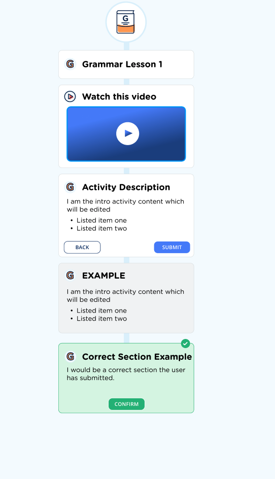

# Exploring the an education activity interface.

A UI experiment for educational activity design. 

Exploring different aspects of the activity interface design. 

## Initial Mock-up

## Definitions

 **activity** - a standalone piece of coursework that would sit inside a course

The way I think about an activity.
 subject > course > unit  > learning activity > interaction (?)

## Initial Thoughts:

Multi-step vertical swipe mechanism.
- Current most popular social media is Tik Tok, the movements on mobile navigation are embedded in common muscle-memory
- 
- 

[ ] Connection between individual interactions
[ ] Visual flow between description and interaction block

## Needs:

[ ] Show correct or incorrect state based on interaction.
[ ] A panel to indicate activity completeness and (?) success

[ ] Mobile-friendly interface ->

- [ ] Snap to scroll sections
- [ ] Max-widths

[ ] Different interaction types ->

- [ ] Multi-choice 
- [ ] Spelling
- [ ] Listen & Repeat
- [ ] Custom HTML ? 
- [ ] Video

## Outside Scope 

[ ] Fonts for learning exploration
[ ] 